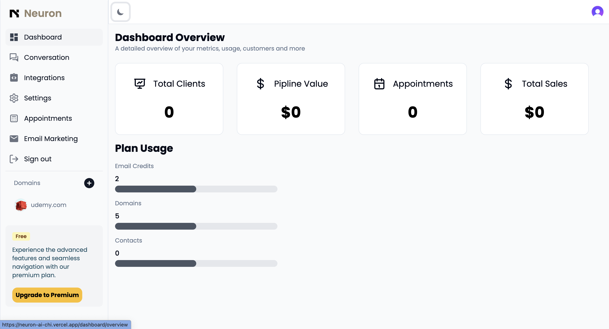
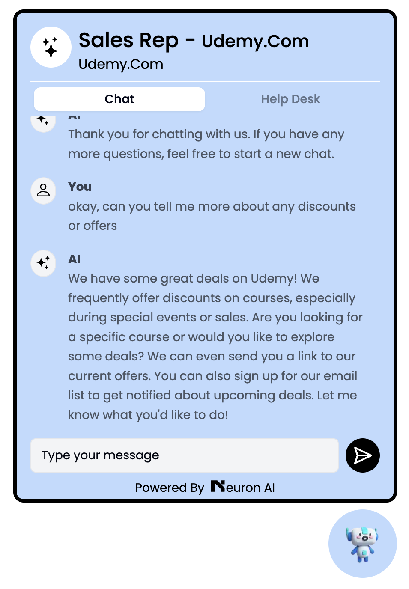

# Neuron

Neuron is an AI-powered SaaS chatbot designed to enhance customer interaction on your website. With sentiment analysis and customization features, Neuron provides an intelligent and personalized communication experience for your users.

## Features

- **AI-Powered Conversations**: Leverage advanced AI to provide accurate and helpful responses to user queries.
- **Sentiment Analysis**: Understand the sentiment behind user messages to respond appropriately.
- **Customizable**: Easily customize the chatbot's appearance and behavior to fit your brand.
- **Embedding**: Simple script to embed Neuron on any website.
- **Scalable**: Built to handle high traffic and scale with your business needs.

## Screenshots

Here are some screenshots of Neuron in action:


_Caption for Screenshot 1_


_Caption for Screenshot 2_


_Caption for Screenshot 3_


_Caption for Screenshot 4_


_Caption for Screenshot 5_

## Getting Started

### Prerequisites

- Node.js
- npm or yarn
- Access to Neuron's API (provided upon subscription)

### Installation

1. Clone the repository:
   ```bash
   git clone https://github.com/yourusername/neuron.git
   ```
2. Navigate to the project directory:
   ```bash
   cd neuron
   ```
3. Install dependencies:
   ```bash
   npm install
   # or
   yarn install
   ```

### Usage

1. Start the development server:
   ```bash
   npm start
   # or
   yarn start
   ```
2. Follow the instructions in the [API documentation](https://github.com/yourusername/neuron/docs) to integrate Neuron into your website.

## Configuration

Configure Neuron by editing the `config.js` file.

Example:

```js
module.exports = {
  apiKey: "YOUR_API_KEY",
  appearance: {
    theme: "dark",
    position: "bottom-right",
  },
};
```
