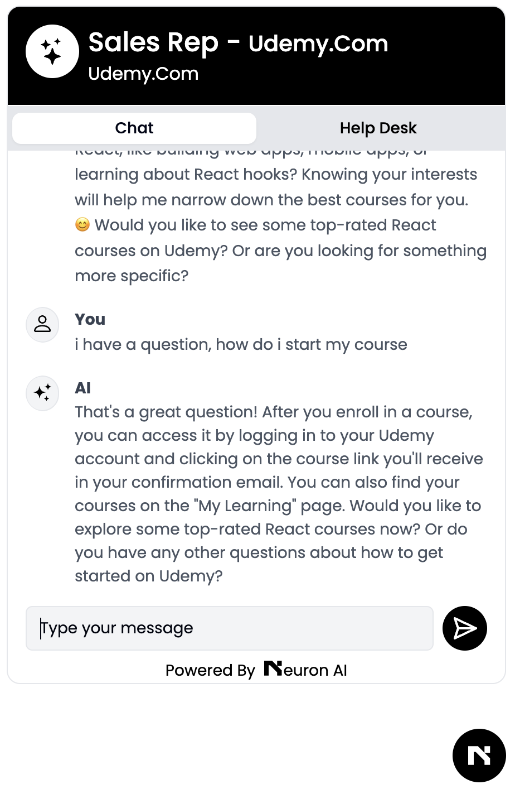
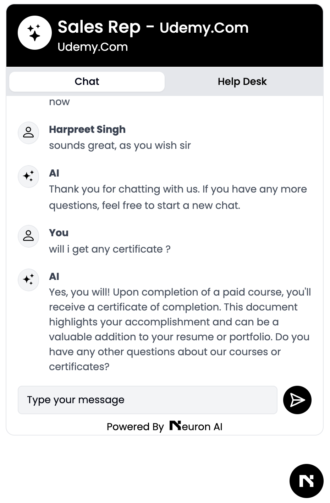
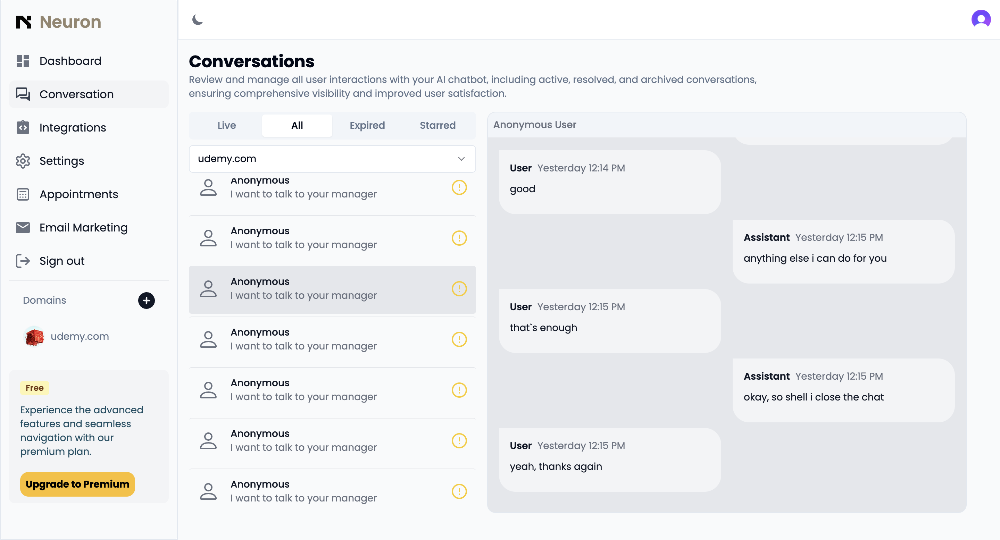

# Neuron

Neuron is an AI-powered SaaS chatbot designed to enhance customer interaction on your website. With sentiment analysis and customization features, Neuron provides an intelligent and personalized communication experience for your users.

Check the Demo here - https://vimeo.com/993312771?share=copy

## Features

- **AI-Powered Conversations**: Leverage advanced AI to provide accurate and helpful responses to user queries.
- **Sentiment Analysis**: Understand the sentiment behind user messages to respond appropriately.
- **Customizable**: Easily customize the chatbot's appearance and behavior to fit your brand.
- **Embedding**: Simple script to embed Neuron on any website.
- **Scalable**: Built to handle high traffic and scale with your business needs.

## Screenshots

Here are some screenshots of Neuron in action:

_dashboard_

_Paste the code snippet into your project_

_stripe integration_

_chatbot design_

_chat with your visitors in realtime_

## Working on

- \*\*Campaign Creation
- \*\*Easy Appointment Scheduling
- \*\*Subscriptions
- \*\*Multi-Language Support
- \*\*Customizable Chatbot Personalities
- \*\*Integrations with CRM Tools
- \*\*AI-Powered Recommendations
- \*\*Analytics and Reporting Dashboard
